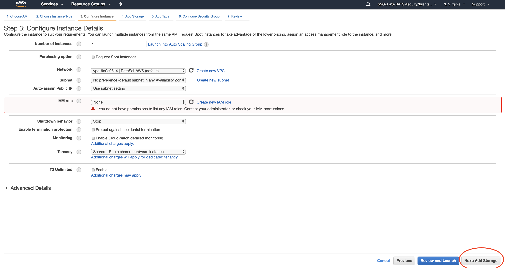

# CREATING AN EC2 INSTANCE with Amazon's Deep Learning AMI

1.	Go to the following link to create your EC2 instance with Amazon's Deep Learning AMI (DLAMI):
http://go.gwu.edu/idpinit
 - Sign in with your "CCAS Cloud ID" (different from your GW net id) and password

---

2.	Once you login, make sure you are in "N. Virginia" Region (on the top right) and select "Services" -> "EC2":

---

3. Choose "Launch Instance"

---

4. Then select the Deep Learning AMI (Ubuntu) Version 6.0 (64 bit)
 

5. It will default to the t2.micro (Free tier eligible) instance. Click "Next: Configure Instance Details"

---

6. It will highlight IAM role and show a warning. Ignore the warning, and choose "Next: Add Storage"

---

7. It will default to a storage of 75GB, choose "Next: Add Tags"
 

---

8. The next step is very important! **You MUST add TWO tags** ("Name" and "gwnetid"). Add them as shown, and then click "Next: Configure Security Groups" 
 
 - "Name" should be your first and last name (as shown)
 - "gwnetid" should be your GW Net ID (your email address w/ out the @gwmail.gwu.edu)

---

9. Choose "Select an existing security group" and choose the first option (DataScience-Default). Then choose "Review and Launch". 
 - If you don't see this option, it's possible that you forgot to change the region to "N. Viriginia" in the top right. If that's the case, change your region and restart on step 2 above.
 

---

10. It will show a warning, telling you that "Your instance configuration is not eligible for the free usage tier", ignore it, and choose "Launch"  

---

11. Enter a name for your private key, don't use spaces, and select "Download Key Pair". 
 - Pay attention to the folder/location where you download your key, you will need it each time you ssh into your instance.
 
 - Hint: If, after downloading your key, the key/file somehow gets renamed to something like `brent_skoumal_ML1_key.pem.txt`, you should right click on it and rename it. 
 - The key has to be saved with the ".pem" extension or else your computer won't treat it as a certificate.
 - For Example: `brent_skoumal_ML1_key.pem`
 
